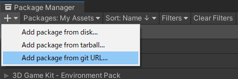
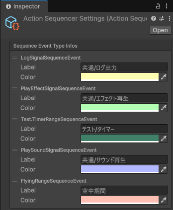
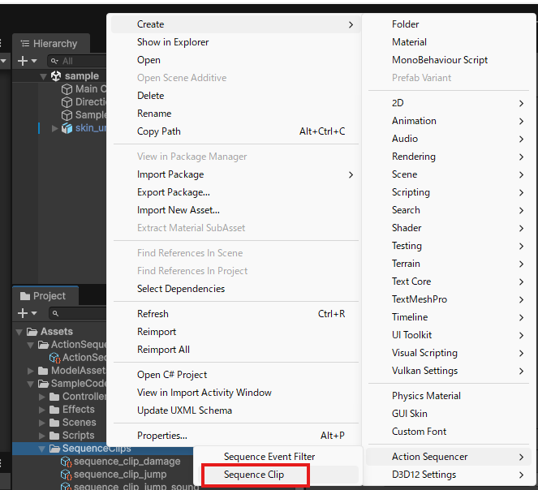
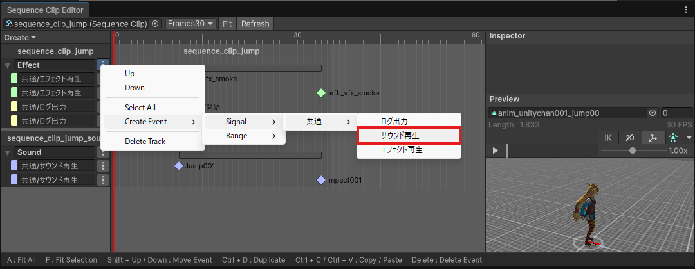
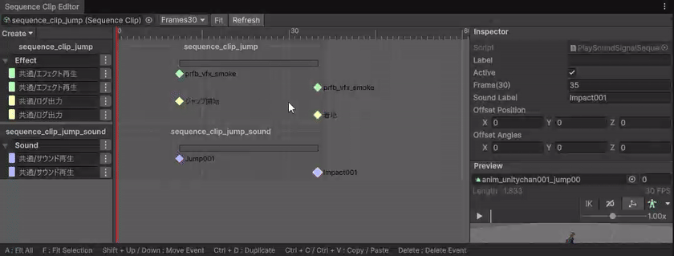

# ActionSequencer

Animator で制御しているアクションに対して、Effect、SE、当たり判定、状態遷移などのイベントを時間軸で重ねるための Unity パッケージです。  
`SequenceClip` に `SignalSequenceEvent` / `RangeSequenceEvent` を配置し、`SequencePlayer` で再生します。


## Features

- `SequenceClip` / `SequenceTrack` / `SequenceEvent` ベースでイベントをアセット管理
- 単発タイミング向けの `SignalSequenceEvent` と、区間処理向けの `RangeSequenceEvent` をサポート
- `SequencePlayer` 1 つで複数の `SequenceClip` を並列再生可能
- `Play(clip, startOffset)` による途中時刻からの再生に対応
- `SequenceHandle` による個別停止、`StopAll()` による一括停止に対応
- ローカル登録とグローバル登録の両方でイベントハンドラをバインド可能
- `ObserveSignalSequenceEventHandler` / `ObserveRangeSequenceEventHandler` により、ラムダで手軽に監視処理を書ける
- `includeClips` により、複数の `SequenceClip` を合成した構成で編集・再生できる
- `SequenceEventFilterData` で Editor 上に表示するイベント型を namespace / パス単位で絞り込める
- UI Toolkit ベースの `SequenceEditorWindow` を同梱
- Preview に `AnimationClip` とオフセット時間を持たせられる
- Play Mode 中は `ISequencePlayerProvider` を経由して現在再生位置をシークバー表示できる
- `ActionSequencerSettings` によりイベント型ごとの表示名と色をカスタマイズできる

## Requirements

- Unity `6000.0` 以降

## Installation

### Install via Package Manager

1. Unity の `Window > Package Manager` を開く
2. `+` ボタンから `Add package from git URL...` を選ぶ
3. 以下を入力してインストールする

```text
https://github.com/DaitokuAmy/action-sequencer.git?path=/Packages/com.daitokuamy.actionsequencer
```

タグを指定する場合は末尾にバージョンを付けます。

```text
https://github.com/DaitokuAmy/action-sequencer.git?path=/Packages/com.daitokuamy.actionsequencer#0.9.0
```



### Install via manifest.json

`Packages/manifest.json` の `dependencies` に以下を追加します。

```json
{
  "dependencies": {
    "com.daitokuamy.actionsequencer": "https://github.com/DaitokuAmy/action-sequencer.git?path=/Packages/com.daitokuamy.actionsequencer"
  }
}
```

## Quick Start

### 1. イベントクラスを作成

まずはアプリケーション固有のイベント型を作成します。

`SignalSequenceEvent` の例:

```csharp
using ActionSequencer;
using UnityEngine;

public sealed class PlaySeSignalSequenceEvent : SignalSequenceEvent
{
    [Tooltip("再生する SE 名")]
    public string seName = "";
}
```

`RangeSequenceEvent` の例:

```csharp
using ActionSequencer;
using UnityEngine;

public sealed class HitboxRangeSequenceEvent : RangeSequenceEvent
{
    [Tooltip("ダメージ量")]
    public int damage = 1;
}
```

### 2. Settings を作成する

`Tools > Action Sequencer > Create Settings` を実行すると、`Assets/ActionSequencer/ActionSequencerSettings.asset` が生成されます。  
このアセットではイベント型ごとに次の内容を設定できます。

- Editor に表示するラベル名
- タイムライン上の表示色



### 3. SequenceClip を作成して編集する

`Create > Action Sequencer > Sequence Clip` で `SequenceClip` を作成します。



作成した `SequenceClip` は次の方法で開けます。

- アセットをダブルクリックする
- Inspector の `Open` ボタンを押す
- `Window > Sequence Tools > Sequence Editor Window` を開く

`SequenceClip` の Inspector では次の設定も行えます。

- `includeClips`
  - 同時に扱う別 `SequenceClip`
- `filterData`
  - Editor 上に表示するイベント型の絞り込み設定

### 4. Track と Event を配置する

Sequence Editor 上で Track を追加し、各 Track のメニューから `Signal` / `Range` イベントを作成します。  
作成したイベントはドラッグで時刻変更、複製、コピー、貼り付け、削除、並び替えができます。



### 5. SequencePlayer で再生する

`SequencePlayer` を生成し、ハンドラを登録してから `Play()` を呼びます。  
更新は `Update(deltaTime)` を自前で回します。

```csharp
using ActionSequencer;
using UnityEngine;

public sealed class ActionSequencerExample : MonoBehaviour
{
    [SerializeField] private SequenceClip _sequenceClip;

    private SequencePlayer _sequencePlayer;

    private void Awake()
    {
        _sequencePlayer = new SequencePlayer();

        _sequencePlayer.BindSignalEventHandler<PlaySeSignalSequenceEvent>(sequenceEvent =>
        {
            Debug.Log($"Play SE: {sequenceEvent.seName}");
        });

        _sequencePlayer.BindRangeEventHandler<HitboxRangeSequenceEvent>(
            sequenceEvent => { Debug.Log($"Hitbox Enter: {sequenceEvent.damage}"); },
            sequenceEvent => { Debug.Log("Hitbox Exit"); },
            (sequenceEvent, elapsedTime) => { },
            sequenceEvent => { Debug.Log("Hitbox Cancel"); });
    }

    private void Update()
    {
        _sequencePlayer.Update(Time.deltaTime);
    }

    public void Play()
    {
        _sequencePlayer.Play(_sequenceClip);
    }

    private void OnDestroy()
    {
        _sequencePlayer.Dispose();
    }
}
```

## Runtime Usage

### Main Types

- `SequenceClip`
  - 再生対象アセット
- `SequenceTrack`
  - イベントを並べる Track
- `SignalSequenceEvent`
  - 単発イベント
- `RangeSequenceEvent`
  - 区間イベント
- `SequencePlayer`
  - 再生本体
- `SequenceHandle`
  - 個別停止用ハンドル

### SequencePlayer の基本フロー

```csharp
var sequencePlayer = new SequencePlayer();

sequencePlayer.BindSignalEventHandler<PlaySeSignalSequenceEvent>(sequenceEvent =>
{
    Debug.Log(sequenceEvent.seName);
});

var handle = sequencePlayer.Play(sequenceClip);

sequencePlayer.Update(Time.deltaTime);

handle.Stop();
sequencePlayer.Dispose();
```

### Handler の書き方

独自ハンドラクラスを作る場合は次のように実装します。

```csharp
using ActionSequencer;
using UnityEngine;

public sealed class PlaySeSignalSequenceEventHandler : SignalSequenceEventHandler<PlaySeSignalSequenceEvent>
{
    private ISePlayer _sePlayer;

    public void Initialize(ISePlayer sePlayer)
    {
        _sePlayer = sePlayer;
    }

    protected override void OnInvoke(PlaySeSignalSequenceEvent sequenceEvent)
    {
        _sePlayer.Play(sequenceEvent.seName);
    }
}

public sealed class HitboxRangeSequenceEventHandler : RangeSequenceEventHandler<HitboxRangeSequenceEvent>
{
    private IHitboxService _hitboxService;

    public void Initialize(IHitboxService hitboxService)
    {
        _hitboxService = hitboxService;
    }

    protected override void OnEnter(HitboxRangeSequenceEvent sequenceEvent)
    {
        _hitboxService.Enable(sequenceEvent.damage);
    }

    protected override void OnExit(HitboxRangeSequenceEvent sequenceEvent)
    {
        _hitboxService.Disable();
    }

    protected override void OnCancel(HitboxRangeSequenceEvent sequenceEvent)
    {
        _hitboxService.Disable();
    }
}
```

外部依存を注入したい場合は、`Bind(..., onInit)` の初期化用 `Action` からハンドラのメソッドを呼べます。

```csharp
var sequencePlayer = new SequencePlayer();

sequencePlayer.BindSignalEventHandler<PlaySeSignalSequenceEvent, PlaySeSignalSequenceEventHandler>(
    onInit: handler => handler.Initialize(sePlayer));

sequencePlayer.BindRangeEventHandler<HitboxRangeSequenceEvent, HitboxRangeSequenceEventHandler>(
    onInit: handler => handler.Initialize(hitboxService));
```

`onInit` はハンドラ生成時に 1 回だけ呼ばれるため、サービスやプレイヤー参照の注入に向いています。

登録は次のいずれかで行えます。

- `BindSignalEventHandler<TEvent, THandler>()`
- `BindRangeEventHandler<TEvent, THandler>()`
- `BindSignalEventHandler<TEvent>(Action<TEvent>)`
- `BindRangeEventHandler<TEvent>(onEnter, onExit, onUpdate, onCancel)`

### Global Handler

複数の `SequencePlayer` で共有したい場合は、静的 API からグローバル登録できます。

```csharp
var disposable = SequencePlayer.BindGlobalSignalEventHandler<PlaySeSignalSequenceEvent>(sequenceEvent =>
{
    Debug.Log(sequenceEvent.seName);
});
```

不要になったら `Dispose()`、または `ResetGlobalEventHandlers()` で解除できます。

### Start Offset / Parallel Playback / Stop

- `Play(sequenceClip, startOffset)` で途中時刻から再生できます
- `SequencePlayer` は複数の `SequenceClip` を同時再生できます
- `SequenceHandle.Stop()` で個別停止できます
- `StopAll()` で一括停止できます
- 再生中の `RangeSequenceEvent` が停止された場合は `Exit` ではなく `Cancel` が呼ばれます

### includeClips

`SequenceClip.includeClips` に追加した `SequenceClip` は、親 Clip と一緒に再生対象になります。  
Editor でも root clip と include clips が統合表示され、ツールバーのドロップダウンから個別に編集対象を切り替えられます。

### SequencePlayerProvider

Play Mode 中に Sequence Editor のシークバーを実行中プレイヤーへ追従させたい場合は、  
`ISequencePlayerProvider` を持つコンポーネントを対象 GameObject の親階層へ置きます。

同梱の `SequencePlayerProvider` を使う場合:

```csharp
using ActionSequencer;
using UnityEngine;

public sealed class SequencePlayerProviderExample : MonoBehaviour
{
    private SequencePlayer _sequencePlayer;

    private void Awake()
    {
        _sequencePlayer = new SequencePlayer();
        SequencePlayerProvider.AddTo(gameObject, _sequencePlayer);
    }
}
```

## Sequence Editor

`SequenceEditorWindow` は UI Toolkit ベースの専用エディタです。  
主に Toolbar、Track Area、Inspector、Preview、Help Bar の 5 つで構成されています。



### Toolbar

- `TargetObjectField`
  - 編集対象の root `SequenceClip`
- `IncludeClipField`
  - `includeClips` から編集対象を切り替える
- `RulerMode`
  - `Seconds` / `Frames30` / `Frames60`
- `Fit`
  - 横幅へ自動フィット
- `Refresh`
  - 参照や表示状態を再構築

### Track Area

- Track の作成、削除、並び替え
- Event の作成、削除、複製、コピー、貼り付け
- Event のドラッグ移動
- Range Event の長さ変更
- 縦ドラッグによる同一 Track 内の並び替え
- 複数選択での一括移動
- Event の有効/無効切り替え

Track のオプションメニューでは、Track 単位の整理と Event 追加を行えます。

- `Up` / `Down`
  - Track の表示順を上下に移動します
- `Select All`
  - その Track にある Event をまとめて選択します
- `Create Event/Signal/...`
  - 単発イベントを追加します
- `Create Event/Range/...`
  - 区間イベントを追加します
- `Delete Track`
  - Track と、その Track に含まれる Event を削除します

Event のオプションメニューやコンテキストメニューでは、Event 単位の編集や複製を行えます。

- `Duplicate`
  - 選択中の Event を複製します
- `Delete`
  - 選択中の Event を削除します
- `Copy`
  - 選択中の Event をクリップボードへコピーします
- `Paste`
  - コピー済みの Event を Track へ貼り付けます。別の `SequenceClip` でコピーした Event でも貼り付け可能です
- `Activate` / `Deactivate`
  - Event の有効状態を切り替えます
- `Move Event/...`
  - 同じ Clip 内の別 Track へ Event を移動します
- `Reset Label`
  - Event の個別ラベルを消して、設定済みの既定表示名へ戻します

### Inspector

選択中の Track / Event を Inspector から編集できます。  
イベントラベルを空にした場合は、`ActionSequencerSettings` で設定した表示名、または型名が既定ラベルとして使われます。

### Preview

- 任意の `AnimationClip` を割り当てて再生確認できます
- プレビュー開始オフセット時間を保存できます
- include clip 側が未設定の場合は root clip の Preview 設定を継承します
- Play Mode 中は `ISequencePlayerProvider` の再生時刻に追従してシークバーを表示します

### Keyboard Shortcuts

- `A`
  - Fit All
- `F`
  - Fit Selection
- `Shift + Up / Down`
  - Event の並び替え
- `Ctrl + D` / `Cmd + D`
  - Duplicate
- `Ctrl + C` / `Cmd + C`
  - Copy
- `Ctrl + V` / `Cmd + V`
  - Paste
- `Delete` / `Backspace`
  - Delete Event

## Sequence Event Filter

`Create > Action Sequencer > Sequence Event Filter` から `SequenceEventFilterData` を作成できます。  
これを `SequenceClip.filterData` に設定すると、Track の `Create Event` メニューに表示するイベント型を絞り込めます。

使用できる項目:

- `namespaceFilters`
  - 許可する namespace
- `pathFilters`
  - 許可する表示パス
- `ignoreNamespaces`
  - 除外する namespace
- `ignorePaths`
  - 除外する表示パス

`ActionSequencerSettings` で設定した表示ラベルも、表示パスの判定に使われます。

## Notes

- `SequenceClip` の `frameRate` は Editor の `RulerMode` と連動します
- `Seconds` モードでも内部的には時間値そのものを保持して編集できます
- `SequenceClip` を開いたときに未使用 SubAsset や破損参照はクリーンアップされます
- 同一イベントインスタンスが複数箇所から参照されていても、再生時は重複実行されません
- `includeClips` は再帰的に統合され、循環参照はガードされます

## License

This project is licensed under the MIT License. See `Packages/com.daitokuamy.actionsequencer/License.md` for details.
