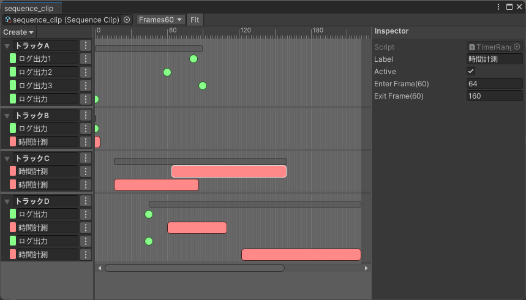
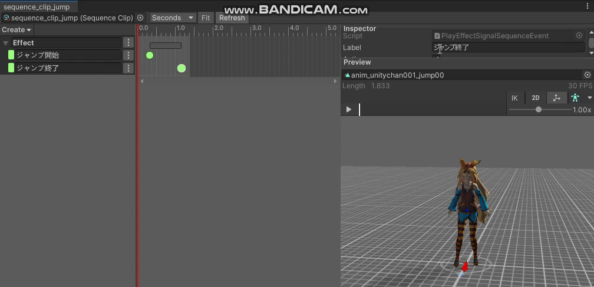
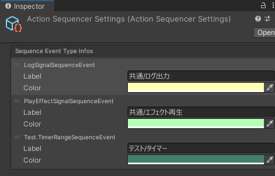
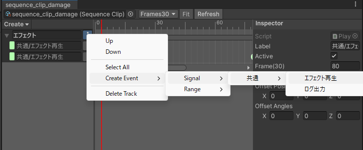
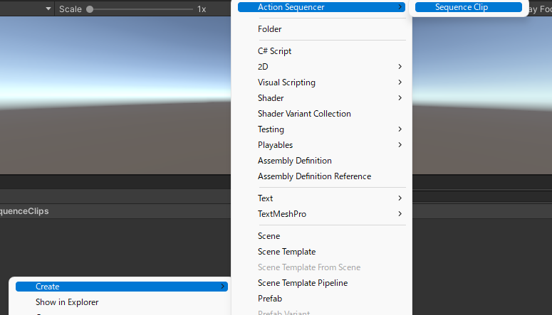
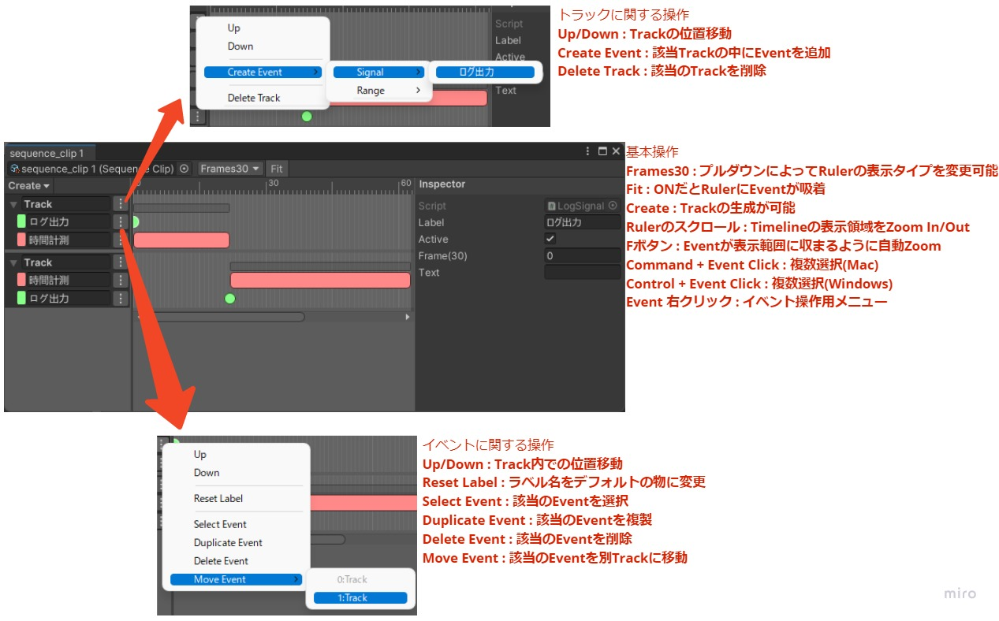

# action-sequencer


## 概要
#### 特徴
* Timelineではなく、Animatorを使って動かす物(Actionと定義)にタイミングや区画を指定するためのツール
* ツールその物は疎結合に出来ているので、使用者の環境に合わせて使い分けが可能
* タイミングを指定するためのイベントの拡張がかなり簡素なので、手軽に使える

#### 背景
Unityに搭載されている「Timeline」「AnimationEvent/AnimationCurve」では、Animator制御による行動に対して演出(Effect, Soundなど)を付け辛い状態でした。  
そのため、行動実行と並列してタイミングとそのパラメータの通知を担う役割が必要になったため作成したツールです。

## セットアップ
#### インストール
1. Window > Package ManagerからPackage Managerを開く
2. 「+」ボタン > Add package from git URL
3. 以下を入力してインストール
   * https://github.com/DaitokuAmy/action-sequencer.git?path=/Packages/com.daitokuamy.actionsequencer
   

あるいはPackages/manifest.jsonを開き、dependenciesブロックに以下を追記します。

```json
{
    "dependencies": {
        "com.daitokuamy.actionsequencer": "https://github.com/DaitokuAmy/action-sequencer.git?path=/Packages/com.daitokuamy.actionsequencer"
    }
}
```
バージョンを指定したい場合には以下のように記述します。

https://github.com/DaitokuAmy/action-sequencer.git?path=/Packages/com.daitokuamy.actionsequencer#1.0.0

## 機能
#### プレビュー
ActionSequencerにはAnimationClipをPreviewする機能がついています  
また、この機能はAnimationClip自体に依存関係を持っていないため、SequenceClipを読み込んでもAnimationClipは読み込まれない点に注意してください


#### ライフサイクル
初期化はSequencePlayerというクラス(Sequenceを再生するためのクラス)を作成する所から始まります
```C#
_sequencePlayer = new SequencePlayer();
```
これだけでは更新が行われないため、適切なイベント発火タイミングを行いたい場所で更新を呼び出します
```C#
_sequencePlayer.Update(Time.deltaTime);
```
終了時はDisposeを行います（もし実行中の区間イベントがあればキャンセルが発火されます）
```C#
_sequencePlayer.Dispose();
```
#### シーケンスの実行
SequenceClipをAssetとして読み込んだ状態で、SequencePlayerに渡す事でシーケンスが始まります  
また、Sequence自体は並列再生可能なのでSequencePlayer一つで様々な用途のイベント管理が可能です
```C#
_sequencePlayer.Play(sequenceClip);

// 開始時間をずらす事も可能(この例は1.0sec)
// _sequencePlayer.Play(sequenceClip, 1.0f);
```
#### シーケンスの停止
基本的には全部流れ終わると自動で止まりますが、止めたい場合はPlayの戻り値に来たHandleを利用して停止します
```C#
_sequenceHandle = _sequencePlayer.Play(sequenceClip);
  :
_sequenceHandle.Stop();
```
#### イベントクラスの作成
基本機能のままだと何も出来ないため、アプリケーション固有のイベントクラスを以下の様に作成します
* SignalEventの場合(任意のタイミングでの処理を定義したい場合)
```C#
public class LogSignalSequenceEvent : SignalSequenceEvent
{
    [Tooltip("出力用のログ")]
    public string text = "";
}
```
* RangeEventの場合(任意の範囲での処理を定義したい場合)
```C#
public class TimerRangeSequenceEvent : RangeSequenceEvent
{
    [Tooltip("出力用のフォーマット")]
    public string format = "Time:{0.000}";
}
```
#### イベントクラスの登録
クラスを追加しただけでも使用は可能ですが、より見やすくするために以下の設定を行う事を推奨します  
**Tools > Action Sequencer > Create Settings** を実行し、設定ファイルを生成した後、  
以下のように設定を入れる事で「**各クラスの表示名(イベント作成時の階層)**」と「**表示色**」を設定できるようになっています  


#### イベントのハンドリング(実行処理の記述)
* SignalEventの場合
```C#
public class LogSignalSequenceEventHandler : SignalSequenceEventHandler<LogSignalSequenceEvent>
{
    /// <summary>
    /// タイミング発火時の処理
    /// </summary>
    protected override void OnInvoke(LogSignalSequenceEvent signalSequenceEvent)
    {
        Debug.Log(signalSequenceEvent.text);
    }
}
```
* RangeEventの場合
```C#
public class TimerRangeSequenceEventHandler : RangeSequenceEventHandler<TimerRangeSequenceEvent>
{
    private Stopwatch _stopwatch = new Stopwatch();
    
    /// <summary>
    /// 開始位置に到達した時の処理
    /// </summary>
    protected override void OnEnter(TimerRangeSequenceEvent sequenceEvent)
    {
        _stopwatch.Restart();
    }

    /// <summary>
    /// 終了位置に到達した時の処理
    /// </summary>
    protected override void OnExit(TimerRangeSequenceEvent sequenceEvent)
    {
        _stopwatch.Stop();
        Debug.Log(string.Format(sequenceEvent.format, _stopwatch.Elapsed.TotalSeconds));
    }

    /// <summary>
    /// 終了する前にキャンセルされた時の処理
    /// </summary>
    protected override void OnCancel(TimerRangeSequenceEvent sequenceEvent)
    {
        OnExit(sequenceEvent);
    }
}
```
#### イベントのBind
イベントの作成、イベントハンドリング処理の記述だけでは動かせず、それらを紐づけ(Bind)する事で機能が動作するようになります  
イベントのハンドリングが必要ないシーンなどでは<b>Bindを行わない、もしくは違うHandlerをBindするなど</b>といった使い分けが可能です
```C#
_sequencePlayer.BindSignalEventHandler<LogSignalSequenceEvent, LogSignalSequenceEventHandler>();
_sequencePlayer.BindRangeEventHandler<TimerRangeSequenceEvent, TimerRangeSequenceEventHandler>();
```
#### SequenceClipの作成
Projectウィンドウにて、<b>「Create > Action Sequencer > Sequence Clip」</b>と選択し、SequenceClipのアセットを作成します

#### SequenceClipの編集
作成されたSequenceClipアセットをダブルクリックする事で以下のようなEditorWindowが開かれるので、そこで必要なイベントの追加や編集を行います


